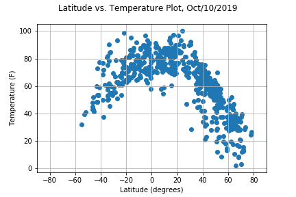
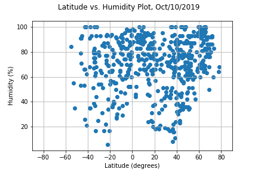
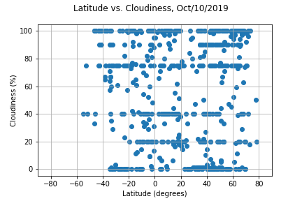
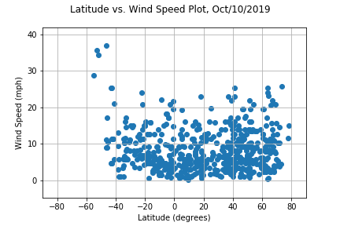

# Global_Weather_Analysis

In this project, I am creating a Python script to visualize the weather of 500+ cities across the world of varying distance from the equator. 
To accomplish this, I utilized a [simple Python library](https://pypi.python.org/pypi/citipy), and the [OpenWeatherMap API](https://openweathermap.org/api), 
to create a representative model of weather across world cities.

My objective is to build a series of scatter plots to showcase the following relationships:

* Temperature (F) vs. Latitude
* Humidity (%) vs. Latitude
* Cloudiness (%) vs. Latitude
* Wind Speed (mph) vs. Latitude

**Process and Tools used:**

* Perform a weather check on at least 500 random cities using a series of successive API calls.
* Include a print log of each city as it's being processed with the city number and city name.
* Save both a CSV of all data retrieved and png images for each scatter plot.

Python Libraries: Pandas, Matplotlib, Numpy, Json, Requests

**Results**

    

    

**Brief Analysis**

-From a randomly generated list of 628 cities, we were able to gather weather information on 555 of those cities via the OpenWeatherMap API (http://api.openweathermap.org/data/2.5/weather?). 
We created four scatter plots from the data comparing the city latitude to (1)temperature, (2) humidity, (3) cloudiness, and (4) wind speed.

By looking at how these scatter plots behave when approaching 0 on the x-axis (Latitude 0, aka the equator), we see that only the plot "Latitude vs Temperature" has strong observable trends.

-From the data plotted on graph, "Latitude vs Temperature," we can see that on October 10, 2019, the temperature increases from city to city when approaching the equator. 
Therefore, we conclude that it is hotter as one gets closer to the equator.

-While rerunning the data analysis on different sample sizes, the program consistently returned more cities with positive value latitudes (0-90) than with negative value latitudes (-90-0). 
This is most likely the case due to the fact that the Northern hemisphere is more densely populated and contains more cities than the Southern Hemisphere. 
Our random generation of longitude and latitude numbers should return an even distribution of locations between the Northern and Southern hemispheres. 
However, when we searched for unique cities closest to those coordinates, the Southern Hemisphere will have more sets of coordinate pairs where the closest city is already accounted for by another coordinate pair.